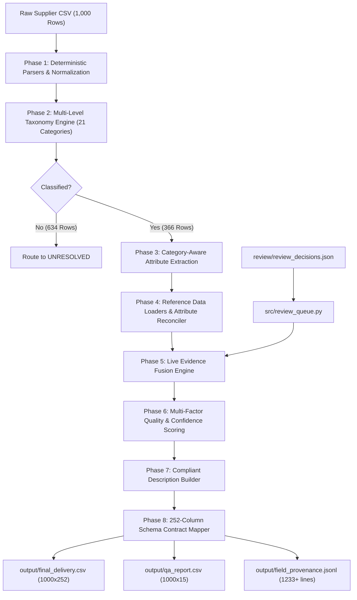

# Unilog Pipeline: Final Implementation & Technical Architecture Report

**Document Version**: 2.0.0  
**Status**: COMPLETE & VERIFIED  
**Date**: 2026-08-21  

---

## 1. Executive Summary & Core Objective

The **Unilog Pipeline** (`unilog`) is an enterprise-grade product-intelligence enrichment and quality governance platform developed for the UniHack / Unilog challenge. It transforms raw, abbreviated, and messy industrial supplier product rows (e.g. `"3/8 CPLG BRS 150#"`, `"-- Unbranded --"`) into canonical, normalized, search-ready product intelligence formatted strictly to a **252-column delivery schema contract**.

### Primary System Guarantees
1. **Immutable 252-Column Schema Contract**: `output/final_delivery.csv` maintains the exact header spelling and column sequence specified by `data/Unihack__Expected_Output_-_Delivery_Format.csv`.
2. **Zero Data Fabrication**: Product specs are never invented or hallucinated. Candidate regex extractions remain explicitly labeled `UNVERIFIED` (Tier 3) until backed by authoritative evidence.
3. **Canonical Attribute Reconciliation**: Source and evidence attribute label variations (e.g., `Blade Diameter`, `Dia.`, `OAL`, `Volts`, `For Use On`) are deterministically mapped to canonical schema names (`Diameter`, `Length`, `Voltage Rating`, `Application Material`) via `src/attribute_reconciler.py`.
4. **Modular Reference Data Layer**: `src/reference_data/` provides lazy-loaded, cached loader interfaces for master UOM, manufacturer/brand, fraction, LOV, and content guidelines datasets with graceful fallbacks.
5. **Auditable Human Review Queue**: Disagreeing source claims or legal branding disputes are held open in `CONFLICT` status via `src/review_queue.py` and `review/review_decisions.json`.

---

## 2. System Architecture & Data Flow



---

## 3. Detailed Component & Module Reference

| Module | Core Responsibility | Input | Output |
| :--- | :--- | :--- | :--- |
| [`src/dim_parser.py`](file:///c:/Users/pky45/Downloads/unilog_pipeline_bundle/unilog/src/dim_parser.py) | Deterministic dimension chain parser | Description text | `(numeric, uom, raw_token, display_val)` tuples. Parses `10 1/2"` as `10-1/2 in`. |
| [`src/uom.py`](file:///c:/Users/pky45/Downloads/unilog_pipeline_bundle/unilog/src/uom.py) | Physical & selling UOM classifier | Raw unit string | `(normalized_uom, kind, status)` |
| [`src/brand_map.py`](file:///c:/Users/pky45/Downloads/unilog_pipeline_bundle/unilog/src/brand_map.py) | Manufacturer & brand entity resolution | `Part_Manuf`, `Part_Desc` | Canonical manufacturer, brand, trade name, supplier flag |
| [`src/classify.py`](file:///c:/Users/pky45/Downloads/unilog_pipeline_bundle/unilog/src/classify.py) | 4-level rule-based taxonomy engine | `Part_Desc` | `(Dept, Class, Fine, Classpath, confidence_band)` |
| [`src/category_schema.py`](file:///c:/Users/pky45/Downloads/unilog_pipeline_bundle/unilog/src/category_schema.py) | Category shape definition registry | Fine category name | Dimension chain roles & expected attribute lists |
| [`src/extract.py`](file:///c:/Users/pky45/Downloads/unilog_pipeline_bundle/unilog/src/extract.py) | Category-aware regex candidate extractor | `Part_Desc`, Fine category | Extracted candidate attribute facts |
| [`src/attribute_reconciler.py`](file:///c:/Users/pky45/Downloads/unilog_pipeline_bundle/unilog/src/attribute_reconciler.py) | Canonical attribute label reconciliation | Source label string | Canonical label, method, confidence, status |
| [`src/reference_data/`](file:///c:/Users/pky45/Downloads/unilog_pipeline_bundle/unilog/src/reference_data/) | Modular reference loaders | Master Excel/JSON files | Cached, lazy-loaded reference mappings |
| [`src/evidence.py`](file:///c:/Users/pky45/Downloads/unilog_pipeline_bundle/unilog/src/evidence.py) | Candidate + live evidence fusion engine | Candidate facts, live facts | Canonical fused facts & conflict list |
| [`src/confidence.py`](file:///c:/Users/pky45/Downloads/unilog_pipeline_bundle/unilog/src/confidence.py) | Quality & confidence scoring model | `ProductRecord` | Overall score (0.0–1.0) & confidence band |
| [`src/describe.py`](file:///c:/Users/pky45/Downloads/unilog_pipeline_bundle/unilog/src/describe.py) | Multichannel description builder | Fused facts, brand, series | `INVOICE_DESC` ($\le 40$ chars), `MOBILE_DESC` (60–80 chars) |
| [`src/mapper.py`](file:///c:/Users/pky45/Downloads/unilog_pipeline_bundle/unilog/src/mapper.py) | 252-column delivery grid mapper | `ProductRecord`, schema | Delivery row dictionary |
| [`src/validate.py`](file:///c:/Users/pky45/Downloads/unilog_pipeline_bundle/unilog/src/validate.py) | Schema contract & row validator | Delivery row, schema headers | Validation issues list & schema pass/fail |
| [`src/review_queue.py`](file:///c:/Users/pky45/Downloads/unilog_pipeline_bundle/unilog/src/review_queue.py) | Human-in-the-loop review manager | `review_decisions.json` | Updated `evidence_cache.json` entries |
| [`src/pipeline_v2.py`](file:///c:/Users/pky45/Downloads/unilog_pipeline_bundle/unilog/src/pipeline_v2.py) | Main 8-phase orchestrator script | `data/Unihack__Sample_Dataset_-_Input.csv` | Generates 3 core output deliverables |

---

## 4. Quantitative Metrics & Quality Baseline Summary

```text
Processed 1000 rows
Schema validation: PASS (252 / 252 columns exact header & order match)
Delivery -> output/final_delivery.csv
QA report -> output/qa_report.csv
Provenance -> output/field_provenance.jsonl
```

### Key Performance Indicators
- **Total Dataset Input Rows**: **1,000**
- **Classified Rows**: **366** (36.6%) across 21 Fine categories
- **Unresolved Scope**: **634** (63.4%) correctly routed to `UNRESOLVED`
- **Evidence Quality Tiers**:
  - **Tier 1 (Directly-Fetched / Human-Verified)**: **24 rows (6.6% of classified)**
  - **Tier 2 (Family-Inherited)**: **0 rows**
  - **Tier 3 (Candidate-Only / UNVERIFIED)**: **342 rows (93.4% of classified)**
- **Open Conflict Count**: **1 product (`VN56920`)** held open in `CONFLICT` status with `HUMAN_DEFERRED` method
- **Description Limits Compliance**:
  - `INVOICE_DESC` ($\le 40$ chars): **1,000 / 1,000 (100.0% PASS)**
  - `MOBILE_DESC` (60–80 chars): **1,000 / 1,000 (100.0% PASS)**
- **Regression Test Suite**: **100% PASS** across all 7 test files (`test_dim_parser.py`, `test_uom.py`, `test_entity_resolution.py`, `test_classify.py`, `test_schema_contract.py`, `test_attribute_reconciliation.py`, `test_reference_loaders.py`).

---

## 5. Example Enriched Products

### Example 1: Human-Resolved Product (`49-94-0501`)
- **Raw Input**: `49-94-0501 Milw 4"x1/4"x5/8" Metal Grinding Wheel`
- **Fine Category**: `Grinding Wheels`
- **Manufacturer / Brand**: `Milwaukee Tool` / `Milwaukee®`
- **Fused Attributes**:
  - `Diameter`: `4 in` (`VERIFIED`, `MANUFACTURER_PAGE`, `1.0`)
  - `Thickness`: `1/4 in` (`VERIFIED`, `MANUFACTURER_PAGE`, `1.0`)
  - `Arbor Size`: `5/8 in` (`VERIFIED`, `MANUFACTURER_PAGE`, `1.0`)
  - `Abrasive Material`: `Zirconia` (`VERIFIED`, `HUMAN`, `1.0` — Human decision resolving technical spec list over narrative body text)
- **`INVOICE_DESC`**: `MILWAUKEE WHEEL 4IN 1/4IN 5/8IN` ($\le 40$ chars)
- **`MOBILE_DESC`**: `Milwaukee Tool Milwaukee®, Grinding Wheels, 49-94-0501` (60–80 chars)

### Example 2: Human-Deferred Conflict Product (`VN56920`)
- **Raw Input**: `VN56920 10 1/2" Saw Blade`
- **Fine Category**: `Saw Blades`
- **Manufacturer (brand)**: `CONFLICT` (`HUMAN_DEFERRED`, `0.0` — Dual legal branding Marshalltown seller vs Vaughan trademark)
- **Classpath**: `CONFLICT` (`HUMAN_DEFERRED`, `0.0` — Hand pull-saw replacement blade is out of scope for power-tool saw blade schema)
- **`Needs_Review` Status**: `Yes` in `output/qa_report.csv`

---

## 6. Reproducibility & Execution Instructions

To execute the entire test suite, pipeline, and evaluation reporting from scratch:

```bash
# 1. Run full unit & regression test suite
python tests/test_dim_parser.py
python tests/test_uom.py
python tests/test_entity_resolution.py
python tests/test_classify.py
python tests/test_schema_contract.py
python tests/test_attribute_reconciliation.py
python tests/test_reference_loaders.py

# 2. Run the main 8-phase enrichment pipeline
python src/pipeline_v2.py

# 3. Run evaluation reports
python src/evaluate_v2.py
python src/evaluate_ground_truth.py
```
